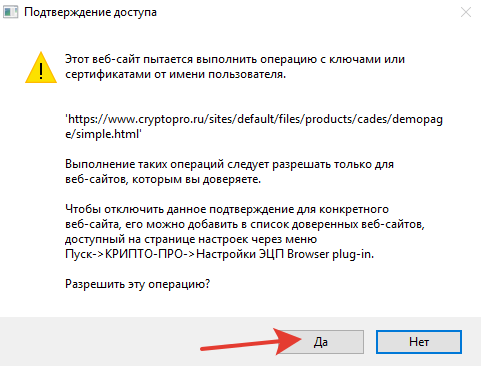

# Добавление сайтов в список доверенных сайтов КриптоПро ЭЦП

По умолчанию, КриптоПро ЭЦП не позволяет задействовать плагин для ЭП сайтам, которые не были добавлены в доверенные. Вместо этого отображая окно подтверждения.

Для того, чтобы убрать это подтверждение, необходимо добавить сайты в доверенные.

## Открыть страницу настройки доверенных сайтов

Найдите значок расширения КриптоПро ЭЦП на панели браузера. Кликните на него и откройте меню расширения. Выберите `Настройка доверенных сайтов`.

<!-- tabs:start -->

### __Chromium GOST__

### __Яндекс.Браузер__

<!-- tabs:end -->

## Добавление доверенных сайтов

Рекомендуемый список ресурсов для добавления в доверенные:

    https://*.cryptopro.ru/
    https://*.roskazna.ru/
    https://*.gov.ru/

Введите в текстовое поле строку для добавления и нажмите кнопку `+`

После добавления всех указанных строк, нажмите `Сохранить`.

Должно отобразиться подтверждение об успешном сохранении списка.

<!-- // code: language=markdown insertSpaces=true tabSize=2 -->
