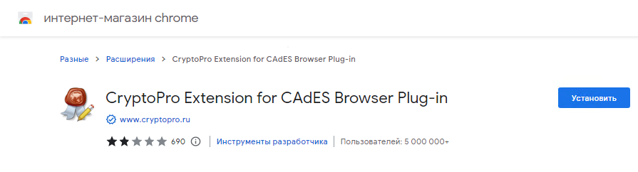
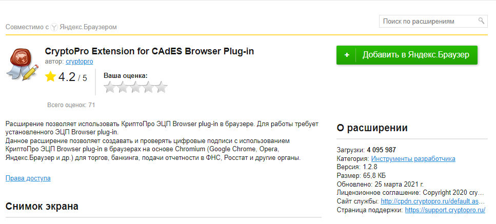

# Установка расширения КриптоПро ЭЦП в браузер

## Chromium GOST, Google Chrome и другие Chromium-based браузеры

После установки КриптоПро ЭЦП browser plug-in в ОС и перезапуска браузера, расширение должно быть предложено к добавлению автоматически, с помощью [соответствующего механизма](https://developer.chrome.com/docs/extensions/mv3/external_extensions/#registry) Chromium для установки расширений программами.

Но если этого не случилось, установите его из Интернет-магазина Chrome.

<https://chrome.google.com/webstore/detail/iifchhfnnmpdbibifmljnfjhpififfog>

## Яндекс.Браузер

В Яндекс.Браузере расширение автоматически не добавляется. Яндекс [отключил этот механизм](https://browser.yandex.ru/help/security/check-extensions.html), т.к. считает его _не безопасным_.

В Яндекс.Браузере расширение можно добавить по ссылке, из интернет-магазина.

<https://addons.opera.com/ru/extensions/details/cryptopro-extension-for-cades-browser-plug-in/>

Или следующим образом:

Откройте настройки Дополнений Яндекс.Браузера (`browser://tune`). Прокрутите до КриптоПро ЭЦП. Нажмите `Установить`.

Вы будете перенаправлены на страницу расширения в Каталоге Opera. Нажмите на кнопку `Добавить в Яндекс.Браузер`.

Подтвердите установку.

## Ссылки

- Официальная документация от разработчика:
  - <https://docs.cryptopro.ru/cades/plugin/plugin-installation-windows>

<!-- // code: language=markdown insertSpaces=true tabSize=2 -->