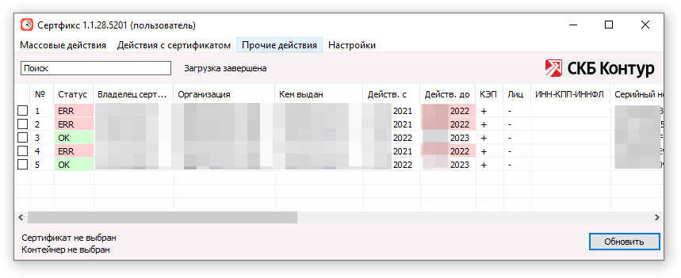

# Контейнеры закрытого ключа

## Что такое контейнер закрытого ключа КриптоПро

Набор файлов (данных), в которых КриптоПро, в собственном проприетарном формате хранит закрытый ключ от сертификата. Возможно так же обеспечить дополнительную защиту контейнера с помощью встроенного шифрования, установив на контейнер пароль.

Контейнер в формате КриптоПро так же может содержать внутри копию сертификата (открытой части ключа), для того, чтобы можно было установить сертификат, имея при себе только носитель. По умолчанию, при первичной установке подписанного УЦ сертификата из файла `.cer` через мастер `Установка личного сертификата`, сертификат копируется в контейнер. Потому в последующем можно будет установить сертификат на компьютер, имея при себе только внешний носитель с контейнером.

> [!ATTENTION]
> Никогда и никому не передавайте закрытую частью ключа. Они не зря называются закрытыми. С помощью закрытой части ключа можно воспользоваться сертификатом и осуществить подпись документа __от вашего непосредственного имени__ или аутентификацию (вход) __под вашим непосредственным именем__ на ИС, использующие сертификаты для аутентификации. Помните, что согласно 63-ФЗ КЭП обязана быть только у владельца (отчуждение не допускается) и владелец отвечает за конфиденциальность КЭП. Передача закрытого ключа = компрометация КЭП.
>
> Передавать можно только открытую часть, подписанную УЦ, в виде файла `.cer`. С помощью только открытой части воспользоваться ЭП не получится. Единственный нюанс, сертификат содержит ПД в виде ИНН и СНИЛС владельца. Потому в открытый доступ неконтролируемому числу лиц (в свободный доступ в интернет, например) лучше его не выставлять.
>
> 

## Экспортируемые, не экспортируемые и неизвлекаемые контейнеры

На контейнере закрытого ключа может быть установлен специальный флаг, запрещающий &laquo;экспортирование&raquo; (извлечение) ключа, как защита от его копирования. Экспортируемый ключ можно свободно копировать между носителями, а вот не экспортируемый ключ через штатные средства КриптоПро CSP скопировать не получится. Криптопровайдер не даст это сделать, так задумано. ¯\\\_(ツ)\_/¯

Но в то же время, запрет экспорта сертификата флагом не является абсолютной его защитой от копирования. Т.к. внештатными средствами, в зависимости от расположения контейнера ключа, его всё равно можно скопировать. Например, если контейнер располагается на обычной флешке, то файлы можно просто скопировать через Проводник Windows... В то же время, сам принцип работы криптопровайдера не может защитить ключ от копирования на 100%, т.к. для того, чтобы им воспользоваться, криптопровайдер извлекает его в память компьютера.

Неизвлекаемым ключ считается, если он был выпущен на смарт-карте активного типа. Смарт-карты активного типа отличаются тем, что кроме защищённого хранения ключей, сами могут выполнять простые криптографические операции через программный интерфейс (PKCS#11). В том числе и осуществлять ЭП набора данных, которые в смарт-карту направляет криптопровайдер. В таком случае, ключ не копируется в память компьютера для использования, потому извлечь его с такой смарт-карты считается невозможным.

## Доступные расположения контейнеров ключей

### Хранение контейнеров ключей на смарт-картах

Смарт-карты (так же могут называться USB-токенами), это носимые устройства специального назначения. Грубо говоря, являются специализированными флешками для хранения контейнеров ключей. Смарт-карты хранят ключи во <abbr title="в зашифрованном виде">внутреннем защищённом представлении</abbr> и открывают доступ к хранимым ключам только после предоставления правильного <abbr title="ПИН-кода">пароля</abbr>.

Традиционно для смарт-карты устанавливается 2 пароля. Пароль пользователя и пароль администратора. Пароль пользователя позволяет получить доступ к ключу. Пароль администратора позволяет так же получить доступ к настройкам смарт-карты и разблокировать и/или сменить пароль пользователя.

Смарт-карта ведёт учёт количеству попыток ввода пароля. В случае превышения указанного количества, она уходит в блокировку. В случае превышения количества попыток ввести пароль администратора, смарт-карта блокируется навечно. Ключи хранимые на заблокированной окончательно смарт-карте уже не извлечь и не воспользоваться ими. Единственный способ восстановить её работоспособность, произвести форматирование. Во время форматирования, содержимое смарт-карты, естественно, удаляется.

Утеря смарт-карты гарантирует сохранность ключей от несанкционированного использования и/или копирования, если злоумышленник не знает от неё пароль или не имеет возможности его подобрать за небольшое число попыток (т.е. не 1-8).

А самое главное, у смарт-карт есть <abbr title="killer-feature">определённый уникальный и очень полезный функционал</abbr> &mdash; они могут быть проброшены на удалённый компьютер при подключении на него через удалённый рабочий стол (RDP). Да, вы подключаетесь, скажем, на свой рабочий компьютер из дома и пользуетесь своими ключами как обычно, при этом забираете смарт-карту с собой домой и втыкаете в компьютер уже дома.

За счёт всего вышеописанного, автор рекомендует хранить ключи на смарт-картах. Смарт-карта пассивного типа уже лучше, чем обычная флешка.

Смарт-карты имеют небольшое количество встроенной памяти, т.к. предназначаются исключительно для хранения ключей, итоговый размер которых исчисляется килобайтами (около 4-5). Одна смарт-карта способна хранить около десятка ключей, в зависимости от модели. Это стоит иметь ввиду, т.к. возможно переполнение смарт-карты, если записать на неё все возможные ключи от разных ИС. Размер памяти смарт-карты уточняйте на сайте производителя или в паспорте.

Существует 2 подвида смарт-карт:

- Смарт-карты __пассивного типа__ обеспечивают только защищённое хранение ключей, но для использования ключи всё равно извлекаются в память компьютера криптопровайдером... Т.к. криптографические операции выполняются непосредственно на процессоре вашего компьютера.
- Смарт-карты __активного типа__ обеспечивают не только защищённое хранение ключей, но так же способны выполнять ряд криптографических операций с ключом самостоятельно через специальный программный интерфейс (PKCS#11). На смарт-картах активного типа, контейнер ключа обычно хранится в __неизвлекаемом виде__, когда дозволяется использование ключа только через этот интерфейс. Но, так же они могут иметь и пассивный режим хранения ключа, для совместимости.

    Для выполнения криптографических операций нужен микропроцессор. Потому они дороже, чем пассивные смарт-карты.

Просмотреть хранимые на смарт-карте контейнеры ключа можно только через криптопровайдер или Панель управления драйвера смарт-карты. В случае примера ниже - это `Панель управления Рутокен`.

### Обычная флешка

Обыкновенный USB флеш-накопитель тоже возможно использовать для хранения контейнеров ключей.

Контейнеры ключей хранятся в файловом представлении, который выглядит как директория с именем, напоминающим `xxxxxxxx.000` в корне файловой системы флешки. Где `x` &mdash; буквы латинского алфавита в нижнем регистре, а `0` &mdash; порядковый номер. Внутри директории лежит 6 файлов с расширением `.key`.

Логика наименования директории до конца автору не ясна, но есть предположение, что для совпадающих наименований владельца сертификатов (CommonName) &mdash; буквенная часть совпадает, потому меняется только порядковый номер.

Директории с контейнерами обязательно должны находиться в корне файловой системы, иначе криптопровайдер перестанет эти контейнеры видеть. Директории возможно переименовать, но на наименование стоит жесткое ограничение &mdash; только латинские символы и цифры. И длина имени не должна превышать 12 символов.

Удаление директории приведёт к удалению контейнера ключа. А учитывая, что на съёмных носителях не работает функционал Корзины, __удаляются они окончательно__. Так же возможно скопировать между флеш-накопителями директорию, в обход копирования через криптопровайдер. При копировании у контейнера ключа будет то же самое наименование и пароль. Скопировать со сменой пароля можно только через криптопровайдер.

Рекомендуется сделать резервное копирование директории с контейнером ключа, путём простой архивации контейнера с помощью любого архиватора. Архиваторы так же позволяют установить дополнительный пароль, в дополнение к паролю, установленного на контейнер ключа. Архив можно расположить рядом на флешке и оставить на всякий случай.

Т.к. на флешке контейнеры ключей хранятся в представлении обычных файлов, любая программа может испортить ключ. Достаточно изменить всего 1 байт в нужном файле и контрольная сумма уже не будет совпадать. Что приведёт к невозможности использования ключа. Так же, кроме шальных программ, файловые системы тоже не вечные и подвержены повреждениям, особенно если они не журналируемые (FAT).

> [!WARNING]
> Не пренебрегайте установкой сложного пароля на контейнер. В случае, если злоумышленник сможет скопировать содержимое директории с ключом, в отличии от смарт-карты, у него будет практически неограниченное число попыток подобрать пароль.

### Реестр ОС Windows на компьютере

Данный способ хранения крайне не рекомендуется, по следующим причинам:

1. Откат реестра Windows до предыдущего состояния (Восстановление системы) может так же &laquo;откатить&raquo; и контейнеры ключей. Автор самолично после случайного удаления восстановил однажды контейнер ключа именно таким образом. А что если вы запишете после создания точки восстановления новый ключ? Возможно, вы его таким образом потеряете.
2. Этот вариант не обеспечивает должным образом конфиденциальность ключей, если компьютером пользуется несколько пользователей поочередно.
3. Копирование ключей в компьютер по сути является __отчуждением ключа__, что для КЭП недопустимо согласно 63-ФЗ.

    Как пример: Считайте, что вы отрезаете себе руку и прикручиваете её к компьютеру, чтобы компьютер мог осуществлять юридически значимую подпись документов от вашего имени, даже без вас. А у вас новая рука отрастает. Потом этой прикрученной к компьютеру третьей рукой подписывают подозрительную платёжку... И ведь будет не отличить!

    Носитель ключа должен быть съёмным. Закончил работу - забрал с собой или положил под ключ.

Контейнеры ключей в реестре Windows хранятся по следующему пути:

`HKEY_LOCAL_MACHINE\SOFTWARE\WOW6432Node\Crypto Pro\Settings\Users\%SID%\Keys`

Где `%SID%` &mdash; уникальный идентификатор безопасности Windows пользователя-владельца.

На ветку реестра установлены специальные права доступа, которые позволяют смотреть только свои ключи реестра, даже если у вас есть права локального администратора. Только от имени `СИСТЕМА` можно просмотреть ключи всех пользователей компьютера. В сети интернет можно найти много способов запустить ПО от имени `NT AUTHORITY\SYSTEM`, от простых с графическим интерфейсом, до сложных через Командную оболочку Windows. Достаточно прав локального администратора. Потому конфиденциальность ключей &mdash; под вопросом.

В теории, ветку можно экспортировать и импортировать на другом компьютере, но на практике, это может привести к сбою считывателя из-за того, что reg-файлы не содержат информации об ACL. Что приведёт к невозможности использовать ключи в реестре до восстановления ACL. У КриптоПро есть [специальная утилита](https://www.cryptopro.ru/downloads) для этого случая, `cpfixit`.

## Как посмотреть список доступных контейнеров ключей

### Используя Панель управления КриптоПро CSP

Откройте Панель управления КриптоПро CSP.

> [!TIP]
> Панель управления КриптоПро CSP прекрасно ищется по слову `Крипто` в меню Пуск.

Перейдите на вкладку `Сервис`, откройте мастер `Сертификаты в контейнере закрытого ключа` по кнопке `Просмотреть сертификаты в контейнере...`. Нажмите на кнопку `Обзор`. В диалоговом окне отобразится список всех доступных контейнеров.

### Используя Инструменты КриптоПро

[Инструменты КриптоПро](https://www.cryptopro.ru/blog/2019/05/21/instrumenty-cryptopro-krossplatformennyi-graficheskii-interfeis) включены только в КриптоПро CSP версии `5.0.*`. Откройте используя ярлык в меню Пуск.

И выберите раздел `Контейнеры`

### Используя утилиту от компании Контур &mdash; Сертфикс

[Ссылка на скачивание](https://h.kontur.ru/certfix)

## Ссылки

- Руководство по обеспечению безопасности использования КЭП
  - <https://roskazna.gov.ru/upload/iblock/9fc/rukovodstvo.pdf>
- Подробный разбор того, как КриптоПро хранит ключ в контейнере и защищает его паролем на Хабре
  - <https://habr.com/ru/post/275039/>
- Копирование ключей КриптоПро CSP
  - <https://uc-itcom.ru/instruction/kak-skopirovat-konteynerzakrytuyu-chast-klyucha>
- Копирование ключей, версия от КонтурЭкстерн
  - <https://www.kontur-extern.ru/info/skopirovat-konteyner-s-sertifikatom>
- Как скопировать ключи КриптоПро. Автор в том числе описывает, как скопировать не экспортируемые ключи из Реестра.
  - <https://serveradmin.ru/perenos-konteynerov-zakryityih-klyuchey-i-sertifikatov-cryptopro/>
- Подробнее о режимах работы смарт-карт
  - <https://t.me/ep_uc/459>
- Статья в базе знаний Рутокен &mdash; &laquo;Выбор модели Рутокен для получения ЭП в УЦ ФНС России и Доверенных лицах УЦ ФНС России&raquo;
  - <https://dev.rutoken.ru/pages/viewpage.action?pageId=98927959>
- Формат текстовых ссылок на контейнеры, применяемых в КриптоПро CSP. Официальная документация.
  - <https://cpdn.cryptopro.ru/content/csp_trunk/html/group___pro_c_s_p_ex_LPSZ_CONTAINER_NAME.html>

<!-- // code: language=markdown insertSpaces=true tabSize=2 -->
