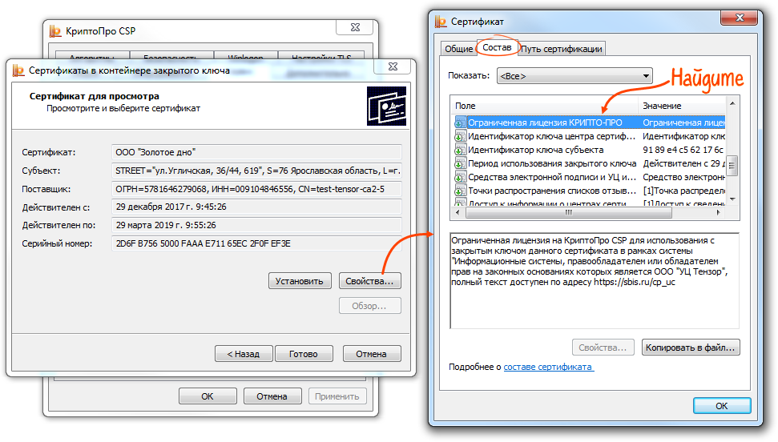
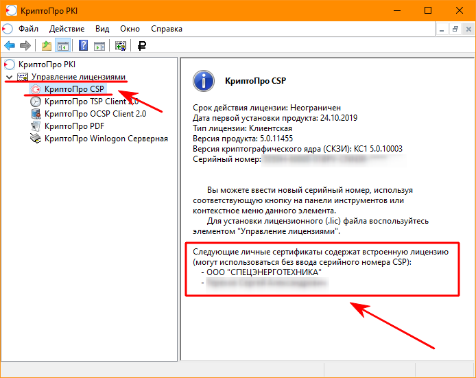

# Доступные версии КриптоПро CSP и о лицензиях

На момент написания статьи доступны 2 возможные ветки продукта для установки.

[Подробное сравнение версий на сайте производителя](https://www.cryptopro.ru/products/csp/compare). В данной статье описывается только значимые для ГИИС ЭБ сравнения, с точки зрения автора.

## Ветка 4.0

Считается неактуальной и <abbr title="В основном, по версии компании производителя, конечно же. Но в то же время, есть функции и ОС, которые ветка 4.0 не поддерживает и уже никогда не станет. Основной функционал ЭП работает стабильно.">&laquo;морально устаревшей&raquo;</abbr>. Т.к. первый выпуск (R1) был в 2016 году.

Последний сертифицированный выпуск 4.0.9963.0 (R4) &mdash; был выпущен 23 ноября 2018 г.

Последний несертифицированный выпуск 4.0.9975.0 (R5) &mdash; был выпущен 30 августа 2020 г. После этого, разработка КриптоПро CSP 4.0 считается завершённой. Получения сертификата соответствия от ФСБ для этой версии не планируется.

Не смотря на наличие новой ветки 5.0, Федеральное Казначейство продолжает активно использовать ветку 4.0. А так же выдаёт лицензии в ТОФК по заявлению на выдачу СКЗИ именно для версии 4.0. И судя по [публикации письма от ООО &laquo;КРИПТО-ПРО&raquo; в официальном канале УЦ Федерального Казначейства](https://t.me/uc_fk/436), о планах компании КриптоПро продлять сертификацию ФСБ для КриптоПро CSP 4.0.9963.0 (R4)... Ветка 4.0 будет использоваться до последнего.

Серийный номер лицензии, применимый к этой ветке, начинается на `4040`.

### Достоинства применения ветки 4.0

- В местном отделении ТОФК (УФК), [по заявке](https://moscow.roskazna.gov.ru/gis/uc/skzi.php), можно получить комплект лицензий СКЗИ для работы с ГИИС ЭБ на 1 АРМ бесплатно (&laquo;во временное пользование&raquo;). Лицензия на КриптоПро CSP выдаётся только для ветки 4.0.
- Эта ветка Федеральным Казначейством непосредственно применяется.
- Единственная ветка, для которой возможно использовать Континент TLS-клиент 2.0.1440.0. Если вам необходимо применение Континент TLS-клиента. В случае если необходимости использования Континент TLS-клиента не наблюдается, можно проигнорировать этот пункт.

### Недостатки применения ветки 4.0

- Нет поддержки смарт-карт активного типа, вроде Рутокен ЭЦП 2.0 и неизвлекаемых ключей. Применение Рутокен ЭЦП 2.0 возможно только в &laquo;пассивном режиме&raquo;, с возможностью извлечения ключа.
- На Windows 11 КриптоПро CSP 4.0.* не работает. Да, он устанавливается, подписывает в КриптоПро ЭЦП и всячески создаёт впечатление, что работает, но не до конца. TLS-соединения с применением алгоритмов ГОСТ не устанавливаются, а потому на его использовании можно ставить крест. В случае Windows 11 применение этой ветки невозможно.

## Ветка 5.0

Актуальная на текущий момент ветка КриптоПро CSP.

КриптоПро CSP версии 5.0.11455.0 (R1) был выпущен 8 мая 2019 г. как первый доступный выпуск.

Последний сертифицированный на момент написания выпуск КриптоПро CSP версии 5.0.12000.0 (R2) был выпущен 24 ноября 2020 г. Этот выпуск ознаменовал переход на новые версии лицензий для ветки 5.0, которые начинаются на `5050`.

Последний несертифицированный на момент написания выпуск КриптоПро CSP версии 5.0.12500.0 (R3) был выпущен 19 мая 2022 г. и ещё может <abbr title="а может они специально build подгадывали под сертификацию и она как раз и будет сертифицирована... ¯\_(ツ)_/¯">обновиться перед сертификацией</abbr>.

### Достоинства применения ветки 5.0

- Возможность работы со смарт-картами активного типа, вроде Рутокен ЭЦП 2.0 и неизвлекаемыми ключами. В основном такое расположение усиленно продвигается для УКЭП выдаваемых ФНС. Поддержка была добавлена начиная с версии 5.0.12000.0 (R2).
- Поддержка Windows 11, начиная с версии 5.0.12000.0 (R2).

Незначительные достоинства:

- Встроенный в дистрибутив упрощённый графический интерфейс для управления контейнерами и сертификатами &mdash; [Инструменты КриптоПро](https://www.cryptopro.ru/blog/2019/05/21/instrumenty-cryptopro-krossplatformennyi-graficheskii-interfeis). Как альтернатива применению Панели управления КриптоПро для управления контейнерами и сертификатами.
- Поддержка DSS или так называемой &laquo;облачной подписи&raquo;. Как возможность на будущее, т.к. ФСБ пока не выпустил стандарт и данный способ подписи невозможно сертифицировать. А значит и применить кому-либо, кроме частных организаций на свой страх и риск.

### Недостатки применения ветки 5.0

- Лицензии от ветки 4.0 поддерживает только версия 5.0.11455.0 (R1). Для версии 5.0.12000.0 (R2) и выше используются новые версии лицензии для ветки 5.0. Это означает, что лицензию выданную по заявлению в УФК можно применить только для 5.0.11455.0 (R1), а в случае необходимости применения 5.0.12000.0 (R2) и выше (например, для неизвлекаемых ключей или Windows 11), придётся приобретать лицензию за свой счёт.
- Континент TLS-клиент версии 2.0.1440.0 не работает с веткой 5.0 и не знает про её существование. А версия 2.0.1482.0 имеет некоторые спорные функции, что могут помешать нормальному использованию программы Континент TLS-клиент, в случае **необходимости** её использования. В случае если необходимости использования Континент TLS-клиента не наблюдается, можно проигнорировать этот пункт.

## Общее для всех указанных веток

Формат контейнеров ключей между ветками не изменялся, потому ключи созданные с помощью КриптоПро CSP 4.0 будут работать на КриптоПро CSP 5.0 и наоборот. С одним исключением. КриптоПро CSP 4.0 не умеет работать с неизвлекаемыми ключами на смарт-картах активного типа.

КриптоПро ЭЦП одинаково работает как с веткой 4.0, так и с веткой 5.0.

Часто, если вопрос не касается отдельного, работающего только на ветке 5.0 функционала, эти ветки взаимозаменяемы.

## Про лицензирование

В этой статье уже было указано, что существует две версии серийных номеров лицензий. `4040` для `4.0.*` и `5050` для `5.0.*`.

Но существуют так же и другие виды лицензий, о которых ниже.

### Пробная лицензия

После первой установки КриптоПро CSP на компьютер, будет применена пробная лицензия на 3 месяца от даты установки. По истечению срока действия пробной лицензии, лицензирование прекращается и начинают применяться ограничения.

При обновлении с КриптоПро CSP ветки 4.0 на `5.0.12000.0` (R2), будет предоставлена новая демонстрационная лицензия, т.к. лицензия от ветки 4.0 не имеет силу.

### Лицензия, встроенная в сертификат

В некоторых УЦ возможно получение сертификата КЭП сразу с зашитой в него лицензией для КриптоПро CSP. Особенностью такой лицензии является то, что она применима только для конкретного сертификата. Т.е. в случае если пробный период использования программы истёк, то полный функционал криптопровайдера сохраняется только для сертификата с лицензией. Но для остальных сертификатов без встроенной лицензии, она не применима, а значит программой будут накладываться ограничения на их использование.

### Как проверить действительность лицензии

Действительность лицензии можно увидеть в Панели управления КриптоПро.

Или используя консоль mmc для управления лицензиями, КриптоПро PKI.

## Ссылки

- Про лицензии в сертификате
  - <https://sbis.ru/help/ep/sczi/built-in_license>
  - <https://ecp-shop.ru/support/kak-proverit-vstroyennuyu-cryptopro-csp/>

<!-- // code: language=markdown insertSpaces=true tabSize=2 -->
