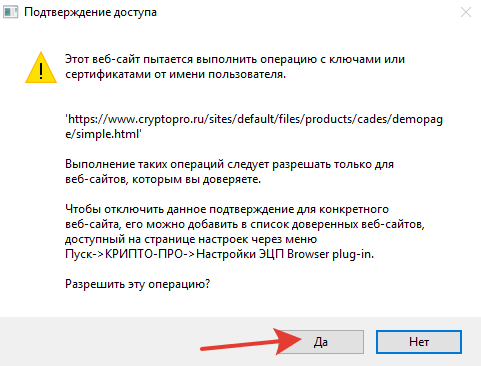

# Установка и настройка браузера ГОСТ TLS

<!-- tabs:start -->

## __Chromium GOST__

Установщик браузера Chromium GOST всегда отрабатывает в тихом режиме, браузер устанавливается в профиль пользователя по двойному клику. После установки, браузер запускается.

## __Яндекс.Браузер__

Установка Яндекс.Браузера производится по двойному клику после скачивания установщика с официального сайта.

<https://browser.yandex.ru/help/about/install.html>

После установки Яндекс.Браузера, убедитесь, что поддержка ГОСТ включена. Она включена по умолчанию, но стоит убедиться.

<https://browser.yandex.ru/help/tls/tls.html#off>

<!-- tabs:end -->

## Установка расширения КриптоПро ЭЦП в браузер

<!-- tabs:start -->

### __Chromium GOST__

После установки КриптоПро ЭЦП browser plug-in в ОС и перезапуска браузера, расширение должно быть предложено к добавлению автоматически, с помощью [соответствующего механизма](https://developer.chrome.com/docs/extensions/mv3/external_extensions/#registry) Chromium для установки расширений программами.

Но если этого не случилось, установите его из Интернет-магазина Chrome.

<https://chrome.google.com/webstore/detail/iifchhfnnmpdbibifmljnfjhpififfog>

### __Яндекс.Браузер__

В Яндекс.Браузере расширение автоматически не добавляется. Яндекс [отключил этот механизм](https://browser.yandex.ru/help/security/check-extensions.html), т.к. считает его _не безопасным_.

В Яндекс.Браузере расширение можно добавить по ссылке, из интернет-магазина.

<https://addons.opera.com/ru/extensions/details/cryptopro-extension-for-cades-browser-plug-in/>

Или следующим образом:

Откройте настройки Дополнений Яндекс.Браузера (`browser://tune`). Прокрутите до КриптоПро ЭЦП. Нажмите `Установить`.

Вы будете перенаправлены на страницу расширения в Каталоге Opera. Нажмите на кнопку `Добавить в Яндекс.Браузер`.

Подтвердите установку.

<!-- tabs:end -->

## Настройка доверенных сайтов в КриптоПро ЭЦП

По умолчанию, КриптоПро ЭЦП не позволяет задействовать плагин для ЭП сайтам, которые не были добавлены в доверенные. Вместо этого отображая окно подтверждения.

Для того, чтобы убрать это подтверждение, необходимо добавить сайты в доверенные.

### Открыть страницу настройки доверенных сайтов

Найдите значок расширения КриптоПро ЭЦП на панели браузера. Кликните на него и откройте меню расширения. Выберите `Настройка доверенных сайтов`.

<!-- tabs:start -->

#### __Chromium GOST__

#### __Яндекс.Браузер__

<!-- tabs:end -->

### Добавление доверенных сайтов

Рекомендуемый список ресурсов для добавления в доверенные:

    https://*.cryptopro.ru/
    https://*.roskazna.ru/
    https://*.gov.ru/

Введите в текстовое поле строку для добавления и нажмите кнопку `+`

После добавления всех указанных строк, нажмите `Сохранить`.

Должно отобразиться подтверждение об успешном сохранении списка.

## Ссылки

- Официальная документация от разработчика:
  - <https://docs.cryptopro.ru/cades/plugin/plugin-installation-windows>
