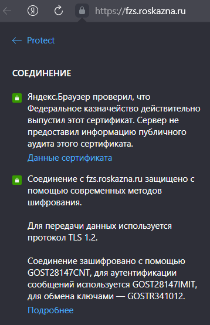

# Проверка работоспособности ГОСТ TLS

## Используя Портал заявителя УЦ ФК (КР)

Откройте выбранный вами браузер ГОСТ TLS.

Перейдите по ссылке `https://fzs.roskazna.ru/`

Должен открыться Портал заявителя УЦ ФК (КР).

<!-- tabs:start -->

### __Chromium GOST__

### __Яндекс.Браузер__

<!-- tabs:end -->

Это означает успешную установку соединения TLS с применением алгоритмов ГОСТ с односторонней аутентификацией (анонимный TLS) через криптопровайдер.

В том числе, это можно понять, просмотрев параметры безопасности соединения. И свойства сертификата сервера.

<!-- tabs:start -->

### __Chromium GOST__

  

### __Яндекс.Браузер__

  

<!-- tabs:end -->

Нажмите на `Войти по сертификату` и выберите свой личный сертификат.

<!-- tabs:start -->

### __Chromium GOST__

### __Яндекс.Браузер__

<!-- tabs:end -->

В случае успешного входа, откроется личный кабинет. В углу появится ФИО.

Это означает уже успешный вход с применением двухсторонней аутентификации, с передачей информации о сертификате пользователя.

<!-- tabs:start -->

### __Chromium GOST__

### __Яндекс.Браузер__

<!-- tabs:end -->

Портал обязательно выдаст ошибку, если вы используете сертификат выданный другим удостоверяющим центром и вернёт вас на fzs.roskazna.ru, где сообщит вам об этом в модальном окне на веб-странице. Но это тоже можно принять за успех, т.к. данные о сертификате были переданы и вас &laquo;успешно отсеяли&raquo;.

## Альтернативный тест с двухсторонней аутентификацией

У компании КриптоПро есть ресурс с тестовой страницей, позволяющий проверить ГОСТ TLS с двухсторонней аутентификацией. В том числе, на нём можно проверить сертификаты, выпущенные УЦ отличными от ФК (КР).

Ресурс располагается по адресу: <https://www.cryptopro.ru:4444/test/tls-cli.asp>

<!-- tabs:start -->

### __Chromium GOST__

### __Яндекс.Браузер__

<!-- tabs:end -->

## Общие рекомендации по работе с ресурсами ГОСТ TLS

Для входа на любой ресурс, защищённый с помощью ГОСТ, обязательно указывайте в адресе URL протокол HTTPS. В закладках тоже. Например:

`https://eb.cert.roskazna.ru/`

Если указать только домен, то браузер может автоматически преобразовать адрес не в HTTPS, а в HTTP.

`HTTP://eb.cert.roskazna.ru/`

Что неправильно. Т.к. TLS по умолчанию подразумевает HTTPS.

И в то же время, это является проблемой, потому что на ресурсах ГИИС ЭБ, на точке доступа, администраторы, во время DDoS атак, приняли решение игнорировать подключения на 80-ом порту (HTTP). Раньше соединения явным образом отклонялись.

Что вызывает следующую картину:

<!-- tabs:start -->

### __Chromium GOST__

### __Яндекс.Браузер__

<!-- tabs:end -->

Это не означает, что Портал ФК &laquo;лежит&raquo;. Просто ссылка указывает на не тот протокол.

Обычно принято использовать [механизм HSTS](https://ru.wikipedia.org/wiki/HSTS) для того, чтобы сообщить браузеру, что нужно использовать HTTPS. Но ГИИС ЭБ оказался исключением... ¯\\\_(ツ)\_/¯

Так же, чтобы такого не случалось, можно вручную прописать политику HSTS в браузере, на сервисной странице по адресу `about://net-internals#HSTS`

<!-- tabs:start -->

### __Chromium GOST__

### __Яндекс.Браузер__

<!-- tabs:end -->

<!-- // code: language=markdown insertSpaces=true tabSize=2 -->
