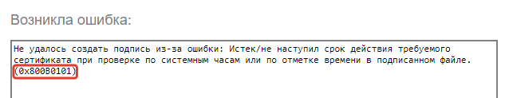

# Тестирование плагина для подписания КриптоПро ЭЦП

КриптоПро для проверки работоспособности плагина предлагает тестовую страницу.

<https://cryptopro.ru/sites/default/files/products/cades/demopage/cades_bes_sample.html>

## Открыть тестовую страницу подписания через расширение

Найдите значок расширения КриптоПро ЭЦП на панели браузера. Кликните на него и откройте меню расширения. Выберите `Проверить работу плагина`.

<!-- tabs:start -->

### __Chromium GOST__

### __Яндекс.Браузер__

<!-- tabs:end -->

## Выполнить тестовую подпись

После загрузки плагина должен появиться список доступных сертификатов, который страница получит через плагин. В этом списке отображаются все доступные контейнеры ключей с сертификатами, неважно, установлены они в Личное или нет.

Выберите необходимый сертификат из списка. В Зеленой рамке отобразится краткая информация о сертификате, текстовое поле и кнопка `Подписать`.

В текстовое поле можно ввести любой текст, этот текст будет подписан через плагин по нажатию кнопки `Подписать`. Если в длинном текстовом поле под надписью `Подпись сформирована успешно` отобразилось много латинских символов вперемешку с цифрами, это результат подписания. Если произошла ошибка, в текстовом поле отобразится код и краткое описание возникшей ошибки.

<!-- // code: language=markdown insertSpaces=true tabSize=2 -->