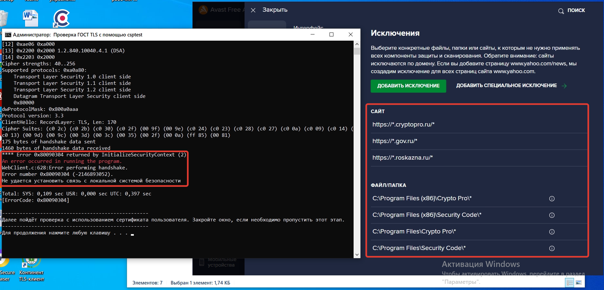

# Конфликты с АВПО

## Dr. Web

АВПО Dr. Web было заслужено записано во вредители для работы с ГИИС "Электронный бюджет". Из-за влияния этого антивируса на работу Континент TLS-клиента, было подано бесчисленное количество заявок и были сожжены миллиарды нервных клеток.

Основная проблема с этим ПО состоит в том, что приостановка защиты или отключение компонентов защиты &mdash; ⚠️ __не помогает продиагностировать проблему__ ⚠️. Люди приостанавливают защиту и думают, что антивирус больше влияет на работу программ, ну вот никак. Но к сожалению, это не так. Компоненты защиты этого антивируса продолжают свою работу и делать то, что делали до этого. Просто, скорее всего, переводятся в разрешительный режим.

Континент TLS-клиент является прозрачным перехватывающим прокси-сервером, позволяющим благодаря своей прозрачной природе подключаться любым программам к ресурсам ГОСТ TLS. Доступ через HTTPS осуществляется с помощью методологии [Man In The Middle](https://ru.wikipedia.org/wiki/%D0%90%D1%82%D0%B0%D0%BA%D0%B0_%D0%BF%D0%BE%D1%81%D1%80%D0%B5%D0%B4%D0%BD%D0%B8%D0%BA%D0%B0), когда TLS-клиент самостоятельно подключается к ресурсам ГОСТ с использованием СКЗИ КриптоПро CSP, а программе выдаёт обычный сертификат для TLS с _общепринятым_ шифрованием.

У Dr.Web, как и у многих других антивирусов, есть функции контроля HTTPS-трафика на вредоносность, вирусы, которая работает с помощью того-же механизма - MiTM.

В результате получается, что HTTPS-прокси в лице АВПО пытается перехватить трафик от HTTPS-прокси, и подставить ему свой сгенерированный локально сертификат, который имеет общепринятые алгоритмы для шифрования TLS-соединения, когда TLS-клиент ожидает увидеть ГОСТ. Что вызывает у последнего когнитивный диссонанс ([undefined behavior](https://ru.wikipedia.org/wiki/%D0%9D%D0%B5%D0%BE%D0%BF%D1%80%D0%B5%D0%B4%D0%B5%D0%BB%D1%91%D0%BD%D0%BD%D0%BE%D0%B5_%D0%BF%D0%BE%D0%B2%D0%B5%D0%B4%D0%B5%D0%BD%D0%B8%D0%B5)).

Обычно, Dr. Web пытается перехватить TLS-трафик именно Континент TLS-клиента. При использовании браузера с поддержкой ГОСТ TLS, он по каким-то причинам лезть не пытается. 🤔

Есть 2 решения этой проблемы:

1. Прописать указанное на рисунке исключение. Это исключение запрещает Dr. Web сканировать трафик Континент TLS-клиента. К сожалению, примера для консоли Централизованного Управления предоставить нет возможности, т.к. не доводилось её видеть. Применение консоли ЦУ подразумевает Enterprise подписку, потому в случае, если непонятно, как это сделать или это исключение не решило проблему (особенно, если после удаления Dr. Web подключиться удалось) &mdash; обратитесь в техподдержку Dr. Web. У нас этого ПО нет, потому за него отвечать не можем. Этот рисунок - всего лишь проверенный на практике пример, предоставленный одним из пользователей.

    

2. Удалить Dr. Web с компьютера. Использовать другое АВПО или встроенный в Windows 10 Microsoft Defender.

## АВПО Kaspersky персональных редакций (Security Cloud, Small Office Security... Кроме Kaspersky Endpoint Security)

С АВПО от Каперского персональных редакций наблюдается та же проблема, что и у Dr. Web. Антивирус пытается влезть в соединение, которое обеспечить не может. Но в отличии от Dr. Web, пытается перехватить трафик от браузеров с поддержкой ГОСТ TLS. Каперский сразу разрывает соединение, как только понимает, что сунул свой нос не туда. Потому в браузере отображается ошибка "Соединение прервано".

Для исправления этой ситуации, нужно перейти в `Параметры угроз и исключений` (поищите в настройках) -> `Указать доверенные программы`. Затем добавить браузер как доверенную программу и запретить сканировать трафик HTTPS. Можно так же добавить только определённые хосты в исключения, если у вас строгие сотрудники ИБ. Убедитесь, что правило активно и настройки сохранены.

Насчёт влияния на Континент TLS-клиент информации недостаточно. Но на нашей памяти, таких случаев не было. Однако, всё может быть, потому в случае, если у вас TLS-клиент и Касперский персональной редакции - прописать такое же правило для TLS-клиента будет не лишним.

Kaspersky Endpoint Security такой проблеме гарантированно не подвержен.

### Пример на картинках, вариант 1

### Пример на картинках, вариант 2

## Avast (Free) Antivirus

Был замечен конфликт этого антивируса с КриптоПро CSP. При попытке соединиться с сайтом по ГОСТ TLS, в криптопровайдере возникает ошибка. Явный конфликт.

Добавление доменов и программ в исключение - не помогло решить проблему.

Некоторым пользователям помогает временное отключение компонентов защиты, при необходимости работы с ГИИС ЭБ. Но это не решение.

<!-- // code: language=markdown insertSpaces=true tabSize=2 -->
